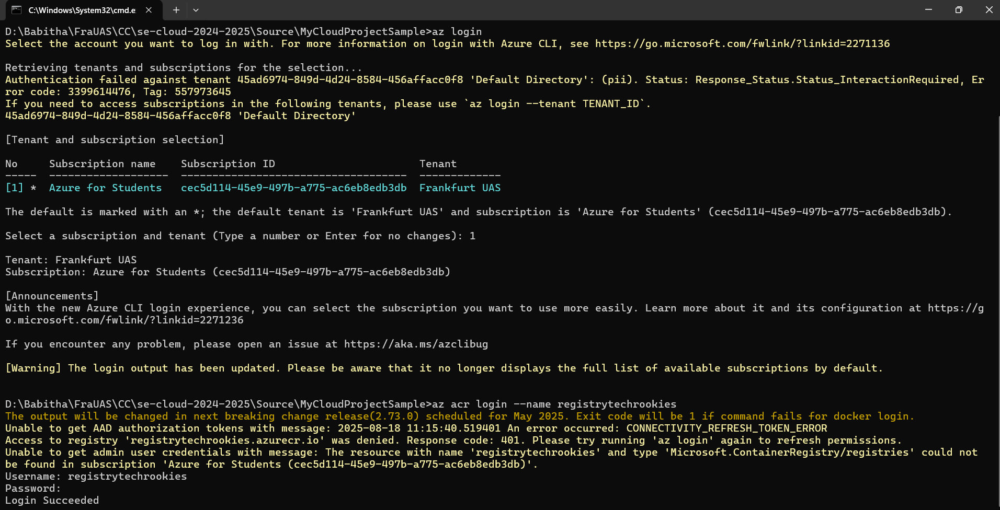
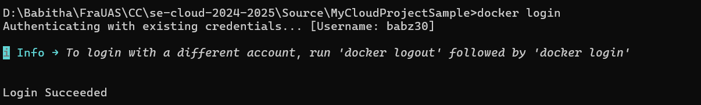
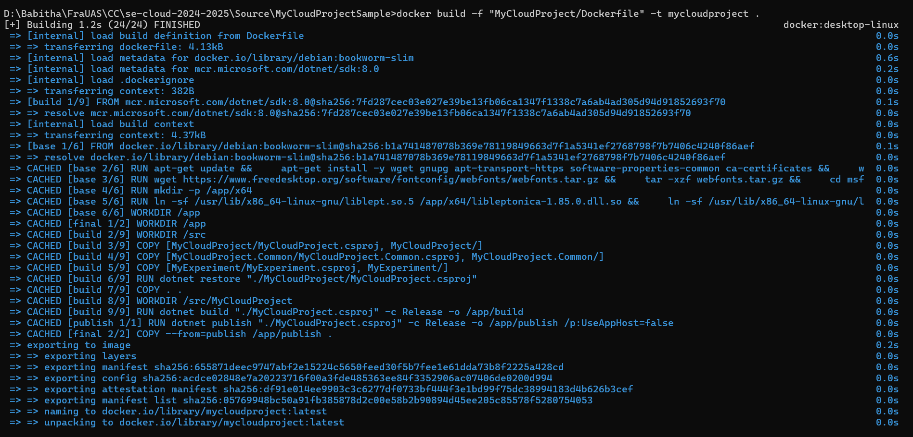

# Project Execution  

This section outlines how to run the OCR project in Azure, including resource setup and execution

## Quick Start

### Login to Azure
```bash
az login
```

### Login to Azure Container Registry
```bash
az acr login --name techrookiesregistry
```
<p align="center">
  
  <br>
  <em>Figure 1: <i>Azure Login </i></em>
</p>


### Pull the Docker image
```bash
docker pull techrookiesregistry.azurecr.io/mycloudproject:latest
```

### Run with custom environment variables 

Create a file named `env.list` with one `KEY=VALUE` per line:

```dotenv
# env.list  (example)
authtoken=Bearer {Your OpenAI Key}
MyConfig__StorageConnectionString=DefaultEndpointsProtocol=https;AccountName=REPLACE;AccountKey=REPLACE;EndpointSuffix=core.windows.net 
```
    
### Run the container using the env file

```bash
docker run --env-file env.list techrookiesregistry.azurecr.io/mycloudproject:latest
```

### Application Configuration (appsettings.json)

The behavior of the pipeline is controlled through the `appsettings.json` file.  
This file defines logging levels, Azure resource mappings (Blob containers, Table, Queue), preprocessing settings (rotations, thresholds, HSI factors), and integration with the OpenAI API for embeddings.

Below is the configuration used in our project:

```json
{
  "Logging": {
    "LogLevel": {
      "Default": "Debug",
      "System": "Information",
      "Microsoft": "Information"
    }
  },

  "MyConfig": {
    "GroupId": "TechRookies",
    "TrainingContainer": "training-files",
    "SetUpContainer": "setup-files",
    "ResultContainer": "result-files",
    "ResultTable": "results",
    "Queue": "trigger-queue"
  },

  "PreprocessingSettings": {
    "RotateAngles": [ -180.0, -90.0, -60.0, -45.0, -30.0, -20.0, -10.0, 10.0, 20.0, 30.0, 45.0, 60.0, 90.0, 180.0 ],
    "Thresholds": [ 50, 150, 200, 250 ],
    "TargetDPIs": [ 100, 200, 300 ],
    "SatFactors": [ 20.0, 10, 5.0, 0.5, 0.2 ],
    "IntensityFactors": [ 20.0, 5.0, 0.5, 0.2 ]
  },

  "Max": 10,
  "API_URL": "https://api.openai.com/v1/embeddings",
  "EMBEDDING_MODEL": "text-embedding-ada-002",
  "MEDIA_TYPE": "application/json",

  "Techniques": [
    "rotation_resize",
    "cannyfilter_invert",
    "chainfilter",
    "invert",
    "hsi_adjustment",
    "denoise",
    "mirror_horizontal"
  ],

  "CosineSimilarityFileName": "CosineSimilarityMatrix.csv"

}

```

#### Explanation of Configuration

| Section                  | Purpose                                                                 |
|---------------------------|-------------------------------------------------------------------------|
| **Logging**              | Controls log verbosity inside Azure Container. Debug-level logs capture preprocessing steps, OCR execution, and failures. |
| **MyConfig**             | Maps pipeline to Azure Storage resources (training, setup, result files, results table, and trigger queue). |
| **PreprocessingSettings**| Defines parameter ranges (rotations, thresholds, DPIs, saturation, intensity) for preprocessing techniques. |
| **Max**                  | Limits the maximum number of preprocessing techniques tested per file (avoids long runtimes). |
| **OpenAI API Settings**  | Embeds extracted OCR text for cosine similarity checks (`text-embedding-ada-002` model). |
| **Techniques**           | Lists preprocessing methods applied systematically (rotation, HSI, denoise, etc.). |
| **CosineSimilarityFileName** | Filename where cosine similarity results are stored for large-scale analysis. |

## Azure-cloud-deployment

To deploy our application in Azure, start by setting up the essential components: Resource Group, Storage Container, Queue, Table, Container Registry, and Container Instances. These components are created manually via the Azure portal. Once configured, you can view and manage all these resources within the specified Resource Group. This setup ensures that all required resources are organized and accessible for effective cloud application deployment and management.

| Azure Services             | Details             |
|----------------------------|---------------------|
| Azure Resource Group       | RG-Team_TechRookies      |
| Azure Container Registry   | registrytechrookies    |
| Azure Container Instances  | techrookiescontainerinstance  |
| Azure Storage              | techrookiesstorage     |
| Result Container           | result-files, setup-files, training-files|
| Result Table               | results          |
| Queue                      | trigger-queue          |

<p align="center">
  
  <br>
  <em>Figure 2: <i>Azure Resource Group- RG-Team_TechRookies </i></em>
</p> 

<p align="center">
  
  <br>
  <em>Figure 3: <i>Azure Storage Account </i></em>
</p> 
[Move to Top](#top)

## Docker Image Creation and Deployment

For the deployment, Docker images were built using Visual Studio, which streamlines the process of containerizing the application. Below are the steps followed to manage Docker images in the deployment process:

### Docker Login

```bash
docker login

```
<p align="center">
  
  <br>
  <em>Figure 4: <i>Successful Docker login </i></em>
</p>


### Build Docker Image in Visual Studio

The application was built and packaged into a Docker image directly within Visual Studio, taking advantage of its integrated tools for Docker support.

<p align="center">
  
  <br>
  <em>Figure 5: <i>Docker Image Build </i></em>
</p>

### List Docker Images

To view the list of Docker images available locally, use the following command:

```bash
docker images
``` 

<p align="center">
  
  <br>
  <em>Figure 6: <i>List docker images using command line</i></em>
</p>

### Tag the Docker Image Locally

```bash
docker tag mycloudproject babz30/techrookies:latest
```

### Push the Image to Docker Hub

```bash
docker push babz30/techrookies:latest
```

<p align="center">
  
  <br>
  <em>Figure 7: <i>Docker image in Docker Hub repository</i></em>
</p>

<p align="center">
  
  <br>
  <em>Figure 8: <i>Docker Hub Tag and Push</i></em>
</p>

## Azure Container Registry (ACR)

### Log in to the Azure Container Registry (ACR)
```bash
az acr login --name techrookiesregistry
```

### Tag the Docker Image for the Azure Container Registry (ACR)
```bash
docker tag mycloudproject techrookiesregistry.azurecr.io/mycloudproject:latest
```

### Push the Image to the Azure Container Registry (ACR)
```bash
docker push techrookiesregistry.azurecr.io/mycloudproject:latest
```
<p align="center">
  
  <br>
  <em>Figure 9: <i>Azure Registry Tag and Push </i></em>
</p>

## Azure Container Instances (ACI)

After pushing the Docker image to the Azure Container Registry, the next step is to deploy it inside an **Azure Container Instance (ACI)**. This allows the OCR pipeline to run in an isolated execution environment without needing any VM management.  

The setup involves three main stages:  

#### 1. Container Image and Registry Configuration
In this step, the container instance is configured with details such as container name, registry, image name, tag, region, and allocated resources (4 vCPUs and 16 GiB memory).  
<p align="center">
  
  <br>
  <em>Figure 10: <i>Configuring container instance with image and registry</i></em>
</p>  

#### 2. Adding Environment Variables
Next, sensitive values such as the **authentication token** and **storage connection string** are securely provided as environment variables. This ensures the container can access Azure Storage and other services without exposing secrets in the code.  
<p align="center">
  
  <br>
  <em>Figure 11: <i>Adding environment variables securely</i></em>
</p>  

#### 3. Review and Create
Finally, all configurations (container details, environment variables, CPU/memory allocation, and networking) are reviewed before deploying the instance.  
<p align="center">
  
  <br>
  <em>Figure 12: <i>Final review before container instance creation</i></em>
</p>  

Once created, the ACI automatically pulls the image from the registry and executes it whenever triggered by the queue message in the Azure Storage Account.  

By building the Docker image in Visual Studio and pushing it to the Azure Container Registry, the application is prepared for deployment in Azure Container Instances. This approach leverages Visual Studio’s capabilities to streamline the development and deployment workflow, ensuring that the containerized application is consistently available and scalable within the Azure ecosystem.

[Move to Top](#top)
