# Results and Findings  

- To validate the system, we used thousands of images from [Kaggle](https://www.kaggle.com/datasets/robikscube/textocr-text-extraction-from-images-dataset), ensuring scalability achieved by migrating to cloud. For clear illustration, we present experiments on **1 to 1000s** of images from the dataset, which reflect the same trends observed in our [SE project results](https://github.com/Babz-30/TextExtractionAPI_Team_TechRookies/blob/main/Documentation/document_md/results.md) on individual image.  

- These results demonstrate both the benefits of the Azure architecture and the comparative performance of different preprocessing techniques, confirming that our pipeline can run at large scale and provide measurable insights into OCR accuracy improvements. We compute the Best preprocessing technique for an individual image (SE Project) and for a complete dataset with 1000s of image (Cloud Project) with stats represented using Bar graph.

## Navigation 
1. [Computing Best Preprocessing Technique for an Individual Image (Enhanced SE Project)](#1-computing-best-preprocessing-technique-for-an-individual-image-enhanced-se-project)
2. [Final Plot computing the Best Preprocessing Technique for the complete dataset with 100s of images (Cloud Project)](#2-final-plot-computing-the-best-preprocessing-technique-for-the-complete-dataset-with-100s-of-images-cloud-project)
3. [Monitoring Container Performance](#3-monitoring-container-performance)
4. [Cloud Computing Experiments](#4-cloud-computing-experiments)
      - [Experiment Result Processing 12 images of our SE project](#experiment-result-processing-12-images-of-our-se-project)
      - [Experiment Result Processing 1000 images](#experiment-result-processing-1000-images)
      - [Experiment Result Processing 10000 images](#experiment-result-processing-10000-images)
5. [Benefits of Cloud Integration](#5-benefits-of-cloud-integration)
6. [Final Observation](#final-observation-from-all-results)

---

## 1. Computing Best Preprocessing Technique for an Individual Image (Enhanced SE Project)

- We have enhanced our SE Project by including Bar Chart generation **automated** in the end of execution, using C# OxyPlot library which slightly changes the presentation but conveys the same message reducing manual work. **OxyPlot** was choosen as it is **cross-platform compatible** but it has few limitation to change axis and have legend in same plot which uses windows libraries not compatible for our linux docker implementation (more research for better library).

**Plot Legend**
- The horizontal bar chart presents the Best preprocessing technique (highlighted) computed based on the same three evaluation metrics in below order:

- **🟩 Green (Dictionary Accuracy)**: Proportion of correctly spelled words identified in OCR results.
- **🟦 Blue (Mean Cosine Similarity)**: Mean of the text embeddings comparison between different preprocessing techniques.
- **🟥 Red (Mean Confidence)**: OCR engine’s internal confidence in its recognition output.

  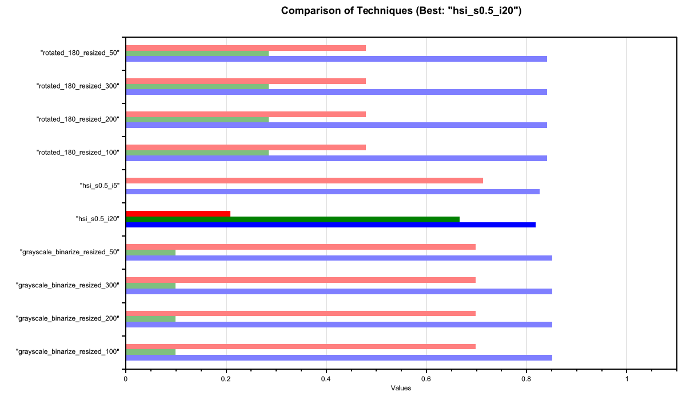
   
  <em>Figure 1: <i>Comparison of Techniques for Individual Image</i></em>

 

**Interpretation:**
- HSI (s=0.5, i=20) clearly outperforms all other methods, achieving strong dictionary accuracy (~0.66) and the high cosine similarity (~0.84) , even though the raw OCR confidence (~0.20) appears modest. This suggests that embeddings and dictionary validation capture deeper accuracy than confidence scores alone.
- Other Techniques (e.g., grayscale + binarization, rotated versions): Many have high OCR confidence, but relatively lower accuracy and similarity.
Interestingly, these preprocessing steps show high OCR confidence scores but not semantic accuracy, confirming that confidence alone is not a reliable performance measure.
- This visualization highlights that no single metric is sufficient for evaluating OCR. By combining similarity, dictionary validation, and confidence, the pipeline provides a multi-perspective evaluation. Among tested methods, HSI (s=0.5, i=20) emerges as the best compromise, showing that subtle adjustments in saturation and intensity significantly enhance OCR performance.

[Move to Top](#top)

---

## 2. Final Plot computing the Best Preprocessing Technique for the complete dataset with 100s of images (Cloud Project)

- We have implemented a final Bar Chart at the end of all the individual image processing which illustrates how many images were successfully processed by each preprocessing technique across the 160-image dataset. The success rate was 94.4%, meaning only a small fraction of images were not processed. 
- MLBarChart [Code](https://github.com/UniversityOfAppliedSciencesFrankfurt/se-cloud-2024-2025/blob/TechRookies/Source/MyCloudProjectSample/MyExperiment/Source/Helpers/MLBarChart.cs)

  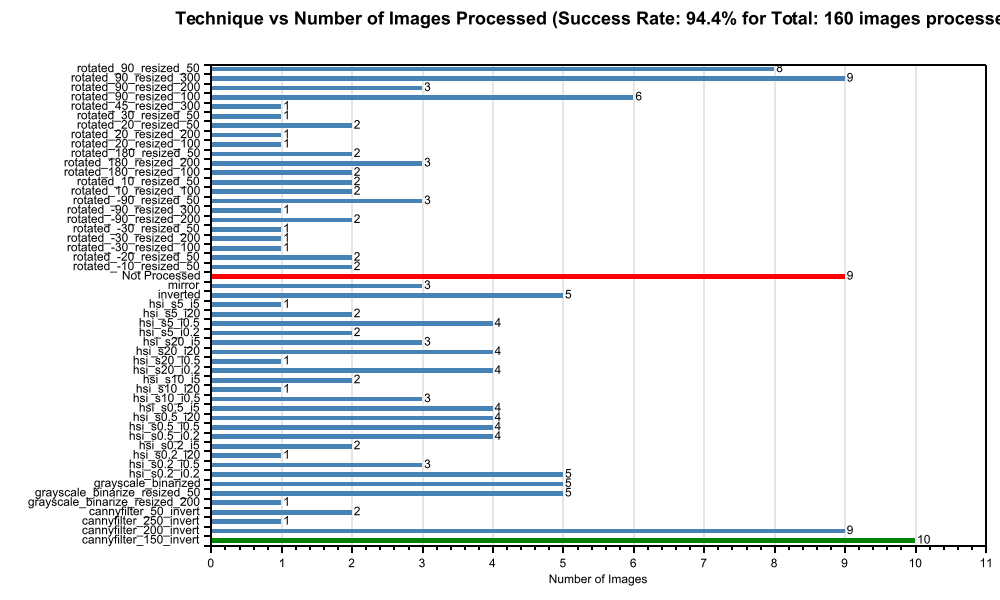
   
  <em>Figure 2: <i>Techniques vs Number of Images processed</i></em>

   

- **Y-axis:** Different preprocessing methods (Grayscale, Binarization, HSI, Rotation + Resize, Canny Filter, etc.).  
- **X-axis:** Number of images successfully processed.  
- **🟩 Green Bars (Best Preprocessing Technique):** This represent technique that processed and consistently proved to be best technique for 10 images. 
- **🟦 Blue Bars (Processed but not Best):** These show techniques that successfully processed images, but fewer than 10 for the dataset. 
- **🟥 Red Bar (Not Processed):** This category reflects 9 images that were skipped. Importantly, this does not only indicate OCR failure. Instead, it means the inputs were blank, invalid, or had no detectable text, and were filtered out during pre-checks.

**Success Rate Calculation**
`Success Rate (%) = ((Total Images - Not Processed Count) / Total Images) × 100`

**Explanation of Terms**
- **Total Images** → The number of input images sent to the pipeline.  
- **Not Processed Count** → The number of images that failed due to errors (e.g., invalid dataset (no detectable text), timeouts, or OCR preprocessing issues).  
- **Success Rate (%)** → The percentage of images successfully processed by the pipeline.

**What This Tells You**
- ✅ High success rate → Your ML model or image preprocessing pipeline is working well.
- ❌ High "Not Processed" → It is required to improve OCR, image dataset, or preprocessing techniques.

**Interpretation:**
- This visualization confirms that the majority of preprocessing techniques are capable of handling most inputs successfully. However, **cannyfilter_150_invert** technique stands out as the most reliable across all images in the dataset. 
- The small number of “Not Processed” cases highlights the importance of input validation and shows that failures were due to invalid dataset (no detectable text) or preprocessing technique which needs adjustments to minimize these count.  

[Move to Top](#top)

---

## 3. Monitoring Container Performance  

- Azure Monitor was used to track the resource consumption of the container instance during the execution of 160 images.

- **Combined CPU + Memory View (for 160 Images, 7 Hours):  1 Azure Container Instance with 1vCPU and 1.5GB RAM**
- **Duration:** ~7 hours 40 minutes (14th August, 16:00 – 23:40).
- **Average CPU Usage:** ~1.04 cores. 
- **Spikes:** 2.2 cores likely when multiple images are being processed simultaneously or some heavier tasks occur (1 core = 1000 millicores).
- **Average Memory Usage:** ~2.1 GB.  
- **Peaks:** Up to 3.5 GB during intensive preprocessing and OCR stages.  
- **Pattern:** Memory usage fluctuates as each image is processed, demonstrating container activity and the load variation across different preprocessing techniques.
- **Throughput:** 160 images in 7.60 h → 460 ÷ 160 = 2.86 min/image ≈ 2 min 53 seconds per image.

  <table>
    <tr>
      <td align="center">
        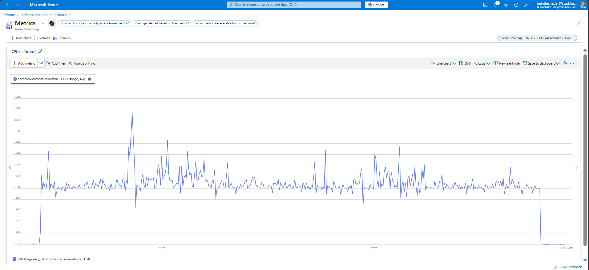
         
        <em>Figure 3: <i>CPU usage of ACI while processing 160 images</i></em>
      </td>
      <td align="center">
        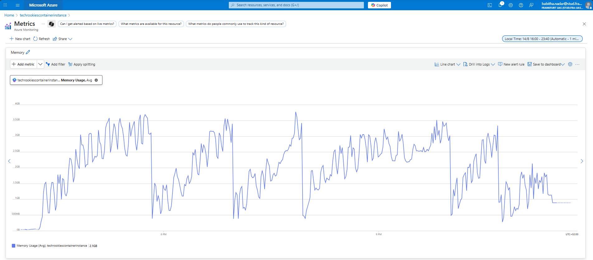
         
        <em>Figure 4: <i>Memory usage of ACI while processing 160 images</i></em>
      </td>
    </tr>
  </table>

**Interpretation:**
- That means each image took on average **~2.6 minutes** under the given resource configuration in [Project Implemention](../Document-md/Project%20Implementation.md) [Project Execution](../Document-md/Project%20%20Execution.md) 
- If you increase CPU allocation (e.g., 2 cores instead of 1), the processing time will likely reduce proportionally (≈ 3–4 hours instead of 7).
- If you increase memory, you can handle larger images or batch more at once, improving efficiency.

[Move to Top](#top)

---

## 4. Cloud Computing Experiments 

### Experiment Result Processing 12 images of our SE project 

- **1 Azure Container Instance with 1vCPU and 1.5GB RAM** Individual image's best preprocessing technique plot [ImageBestTechniquePlots](../Images/results/Ex-2%20SE%20Proj%20Examples/) and all the intermediate files are stored in blob storage.
- **Overall Best Preprocessing Technique of the processed Dataset:** grayscale_binarized
- **Total Images:** 12
- **Not Processed Count:** 0
- **Success Rate:** 100 %

  
   
  <em>Figure 5: <i>Final Experiment Plot for SE Project images.</i></em>

 

  
   
  <em>Figure 6: <i>Default Resource Configuration</i></em>

 

**Interpretation:**
- We have automated the complete process of extracting text from image (~2-3 minutes per image processing) and plotting the individual image's best preprocessing technique (earlier manually running python script). 
- Moving to cloud has made the project scalable, flexible, reliable and reusable.

---

### Experiment Result Processing 1000 images

- **Overall Best Preprocessing Technique of the processed Dataset:** Rotated_90_resized_50
- **Total Images:** 1000
- **Not Processed Count:** 76 (input image had no detectable text)
- **Success Rate:** 92.4 % 

  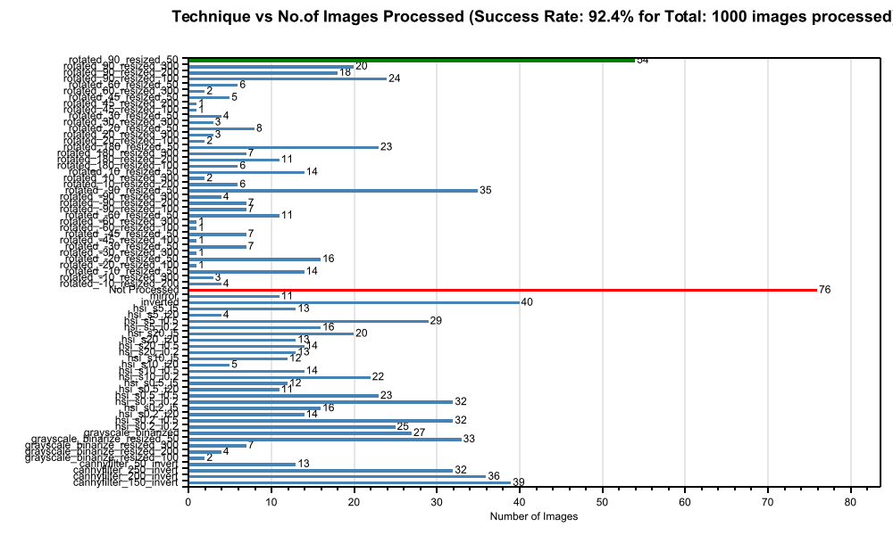
   
  <em>Figure 7: <i>Final Experiment Plot for 1000 Images.</i></em>

 

**Memory View (1000 Images):  5 Azure Container Instance each with 4vCPUs and 16GB RAM** 

- **Duration:** ~14 hours 15 minutes (20th August, 09:15 – 21st August, 11:30).
- **Average Memory Usage (per container):** ~5.0 GB.
- **Peaks:** Gradual ramp-up with sustained memory usage between 4.5 GB – 5.5 GB, showing heavier workload compared to the 160 images experiment.
- **Throughput:** 1000 images in 14.25 h → 855 ÷ 1000 = 0.86 min/image ≈ 52 seconds per image.

  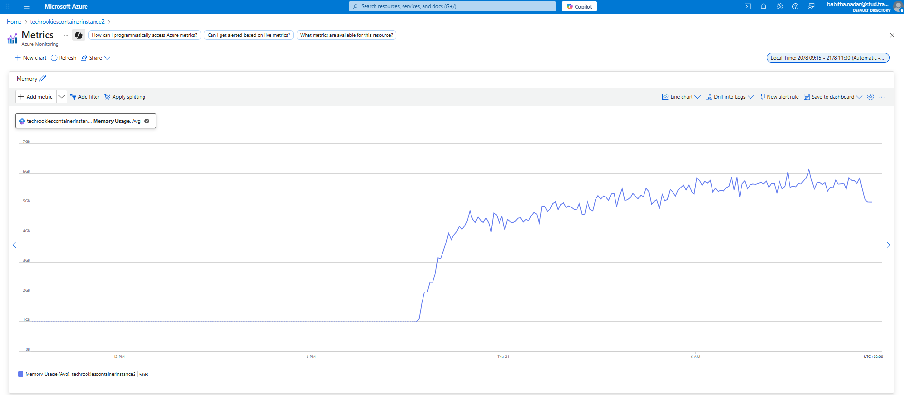
   
  <em>Figure 8: <i>Memory usage of one ACI while processing part of 1000 images</i></em>

 

  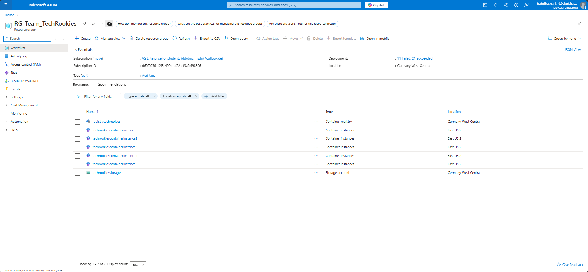
   
  <em>Figure 9: <i>Resource Configuration for 1000 Image processing.</i></em>

 

**Interpretation:**
- That means each image took on average **~0.86 minutes** under the given resource configuration.
- The per-image processing time improved compared to the 160 images experiment (~2.6 min/image → ~0.86 min/image) with parallel processing using 5 instances.
- Memory demand grew significantly (≈5 GB vs. ≈2.1 GB for 160 images), so the container scaled its memory usage proportionally with workload size.

---

### Experiment Result Processing 10000 images

- **Overall Best Preprocessing Technique of the processed Dataset:** cannyfilter_250_invert
- **Total Images:** 10000
- **Not Processed Count:** 475 (input image had no detectable text)
- **Success Rate:** 95.2 %

  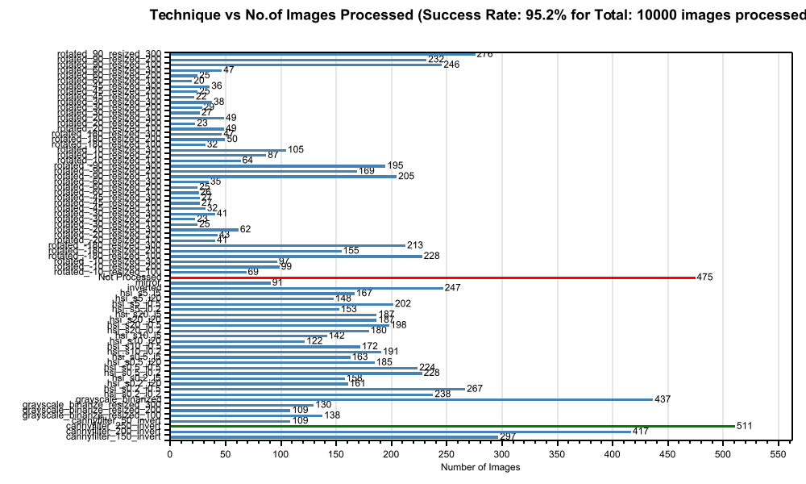
   
  <em>Figure 10: <i>Final Experiment Plot for 10000 Images.</i></em>

 

**Memory View (10000 Images):  10 Azure Container Instance each with 2vCPUs and 12GB RAM** 

- **Duration:** ~1 day 2 hours 30 minutes (24th August, 11:30 AM – 25th August, 2:00 PM).
- **Average Memory Usage (per container):** ~5.0 GB.
- **Peaks:** Memory climbed gradually and stabilized between 4.5 – 6.0 GB per container.
- **Throughput:** 10,000 images in 26.5 h → 1590 ÷ 10,000 = 0.159 min/image ≈ 9.6 seconds per image.

  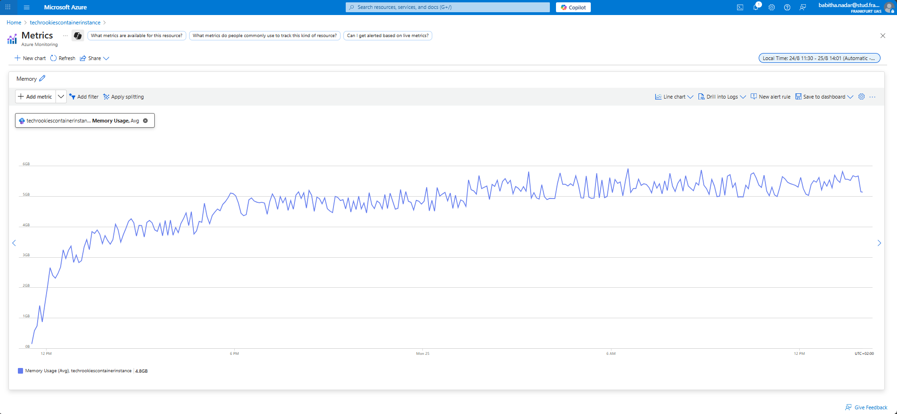
   
  <em>Figure 11: <i>Memory usage of one ACI while processing part of 10000 images</i></em>

 

  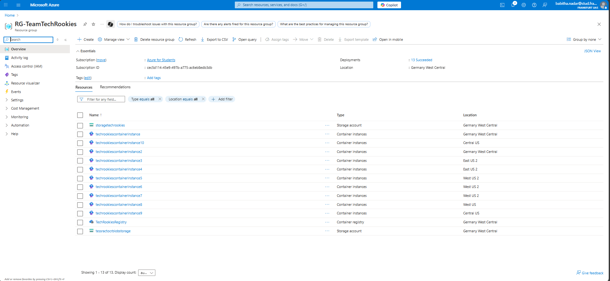
   
  <em>Figure 12: <i>Resource Configuration for 10000 Image processing.</i></em>

 

**Interpretation:**
- With limited timeline and flexible resource configuration we have activated 10 ACIs to process 10000 images with 2vCPUs and 12GB RAM (Since max usage for app is 5-6GB we can further reduce RAM size).
- Using 10 ACIs in parallel gave ~6× improvement in efficiency per image compared to the 1000-image run.
- Plenty of memory headroom remains, so further speedup would come from adding more vCPUs per container or more containers in parallel.
- Per-image processing time improved drastically (160 images → 2.6 min/image, 1000 images → 0.86 min/image, 10,000 images → ~0.16 min/image).

[Move to Top](#top)

---

## 5. Benefits of Cloud Integration

### a. Practically Unlimited Storage
- On a local machine, disk space is finite and managing large datasets is difficult. In Azure Blob Storage, we can store petabytes of images and experiment results.
- A standard Azure Storage account (GPv2) provides up to 5 PiB (pebibytes) of storage by default, roughly 5,000 TB. So your image datasets and experiment outputs can scale almost indefinitely. You can create up to 250 storage accounts per region per subscription by default (and up to 500 with approval).

### b. Powerful and Scalable Compute Resources
- Locally, processing images with OCR and similarity checks is limited by CPU/GPU of one machine.
- In Azure, we can allocate more CPU/memory (Azure Container Instances or Azure Kubernetes Service) when workload increases. Default virtual machine (VM) and core quotas are governed by subscription-level.
- Enables parallel processing of large image datasets, reducing execution time significantly.

### c. Resilient, Long-Running & Reliable Execution
- Local machines risk interruption (shutdown, OS updates, power cuts).
- Azure lets containers and computational workloads run unattended for days or even weeks, far beyond what a local desktop could reliably handle.
- Restart policies in services like Azure Container Instances or Kubernetes recovers automatically which ensures high availability even in the event of crashes.

### d. Component Independent, Decoupled Architecture
- Locally, the application runs as one monolithic process.
- In Azure, we split into independent components:
  - Queue → receives experiment requests.
  - Blob → stores input images and output results.
  - Table → records experiment metadata and accuracy results.
  - Compute (Container Instance/Functions) → runs OCR + similarity pipeline.
- This loosely coupled design improves reliability: if one component fails, others continue to function.

### e. Real-Time Monitoring & Diagnostics
- Locally, logs are limited to console files and hard to analyze.
- In Azure, we get centralized monitoring via Azure Monitor, Application Insights, and Container Logs:
  - Real-time performance tracking and sage statistics.
  - Error detection and alerts (e.g., memory overuse, OCR errors).
- This provides end-to-end visibility of the entire workflow.

### f. Cost-Efficiency & Flexibility
- Instead of investing in powerful local hardware, Azure offers pay-as-you-go scaling: add more compute when needed, turn off when done.
- Saves hardware cost, electricity, and maintenance overhead.

### g. Collaboration & Accessibility
- Results stored in Azure (Blob/Table) are accessible anywhere, anytime.
- Multiple researchers/teammates can collaborate without sharing local machines.
- Ensures consistent datasets and experiment reproducibility.

### Summary
| Feature                         | Local Environment                   | Azure Cloud                                 |
| ------------------------------- | ----------------------------------- | ------------------------------------------------------------- |
| **Storage Capacity**            | Limited by local disk (~TBs)        | Up to **5 PiB per account**, 250 accounts/region              |
| **Network Throughput**          | Varies (limited by NIC)             | Ingress up to **60 Gbps**, Egress up to **200 Gbps**          |
| **Compute Resources**           | Limited by single machine’s CPU/GPU | Default **4 vCPUs per region** (East US), scalable to **2,500+ cores** (AML) |
| **Runtime Stability**           | Prone to shutdowns or disruptions   | Supports days-long runs with restart resiliency               |
| **Architecture**                | Monolithic process                  | Decoupled services: Queue, Blob, Table, Compute               |
| **Monitoring**                  | Console logs only                   | Full monitoring stack with Alerts and Diagnostics             |
| **Cost Model**                  | Fixed hardware cost                 | Pay-as-you-go, scale dynamically                              |
| **Collaboration**               | Local files, hard to share          | Shared, persistent storage across team                        |
| **Scalability & Extensibility** | Hard to optionally scale or change  | Easily extendable with AI, serverless, orchestration services |

---

## Final Observation from All Results  

By leveraging Azure’s elastic compute, resilient container execution, and virtually unlimited storage, we validated that large-scale OCR research can be automated, monitored, and extended far beyond the constraints of local environments. The findings show that Azure not only enables scientific reproducibility and scalability, but also provides a future-ready foundation for advanced text recognition experiments all under one roof. 

### 📊 Explanation of Cost Metrics

  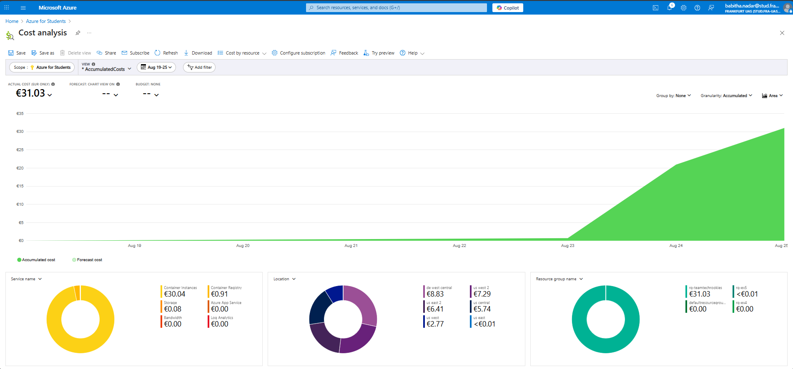
   
  <em>Figure 13: <i>Cost Analysis</i></em>

 

**Interpretation**
- The total accumulated cost between 19th–25th August is €31.03.
- The major contributor is Azure Container Instances (ACI) at €30.04, which indicates that most cost comes from compute resources.
- Container Registry costs are minimal (€0.91), and Storage is negligible (€0.08).
- Costs are spread across multiple regions (e.g., Germany West Central €8.83, US West 2 €7.29, US East 2 €6.41), showing the deployment utilized global Azure infrastructure.
- Per-image processing time improved drastically **(160 images → 2.6 min/image, 1000 images → 0.86 min/image, 10,000 images → ~0.16 min/image).**

This project demonstrated the power of Azure Container Instances for large-scale image processing, achieving scalability, flexibility, and transparent cost monitoring. While the total cost for our workload was €31.03, most of it was due to container compute resources. In the future, costs can be reduced through resource right-sizing, auto-scaling, batching workloads, and adopting reserved/spot pricing. These optimizations will ensure that our cloud-based system remains scalable, efficient, and cost-effective for larger production deployments.
  
[Move to Top](#top)
